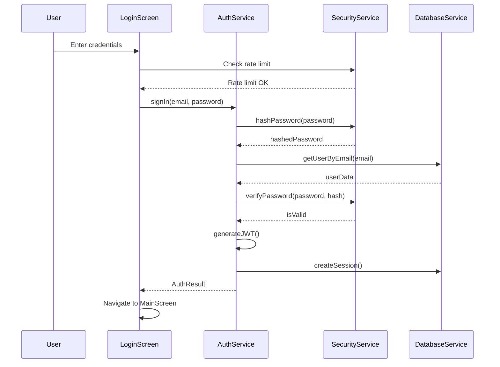

# AgriChain API Integration Guide

## Table of Contents
1. [Overview](#overview)
2. [Architecture](#architecture)
3. [Authentication System](#authentication-system)
4. [Database Configuration](#database-configuration)
5. [Security Implementation](#security-implementation)
6. [KYC Integration](#kyc-integration)
7. [API Endpoints](#api-endpoints)
8. [Configuration Management](#configuration-management)
9. [Error Handling](#error-handling)
10. [Testing](#testing)
11. [Deployment](#deployment)

## Overview

AgriChain is a comprehensive agricultural platform that integrates blockchain technology with traditional farming practices. This guide covers the technical implementation of the authentication system, database configuration, security measures, and API integrations.

### Key Features
- Secure user authentication with JWT tokens
- Role-based access control (Farmer, Buyer, Admin)
- KYC integration with DigiLocker
- Encrypted data storage
- Rate limiting and security monitoring
- Comprehensive logging and audit trails

## Architecture

### System Components
```
┌─────────────────┐    ┌─────────────────┐    ┌─────────────────┐
│   Flutter App   │    │   Auth Service  │    │  Database       │
│                 │◄──►│                 │◄──►│  (SQLite)       │
│  - Login Screen │    │  - JWT Tokens   │    │  - User Data    │
│  - Main App     │    │  - Sessions     │    │  - Sessions     │
└─────────────────┘    └─────────────────┘    └─────────────────┘
         │                       │                       │
         ▼                       ▼                       ▼
┌─────────────────┐    ┌─────────────────┐    ┌─────────────────┐
│ Security Service│    │   KYC Service   │    │ Config Manager  │
│                 │    │                 │    │                 │
│ - Encryption    │    │ - DigiLocker    │    │ - Environment   │
│ - Rate Limiting │    │ - Verification  │    │ - Settings      │
└─────────────────┘    └─────────────────┘    └─────────────────┘
```

### Data Flow
1. **App Initialization**: Configuration → Database → Security → Auth → KYC
2. **User Login**: Input Validation → Rate Limiting → Authentication → Session Creation
3. **API Requests**: Token Validation → Authorization → Business Logic → Response
4. **Security Monitoring**: Logging → Analysis → Alerts

## Authentication System

### Implementation Files
- `lib/services/auth_service.dart` - Core authentication logic
- `lib/services/security_service.dart` - Security utilities
- `lib/services/database_service.dart` - Data persistence
- `lib/screens/login_screen.dart` - User interface

### Authentication Flow


### Key Features
- **Password Security**: Bcrypt-style hashing with salt
- **Session Management**: JWT tokens with configurable expiry
- **Rate Limiting**: Configurable login attempt limits
- **Account Lockout**: Temporary lockout after failed attempts
- **Multi-factor Authentication**: Ready for SMS/Email verification

### Code Example
```dart
// Sign in a user
final authService = AuthService();
final result = await authService.signIn(
  email: 'user@example.com',
  password: 'securePassword123!',
);

if (result.success) {
  // Navigate to main app
  Navigator.pushReplacement(context, 
    MaterialPageRoute(builder: (_) => MainScreen()));
} else {
  // Show error message
  showError(result.message);
}
```

## Database Configuration

### Schema Design
The application uses SQLite with the following tables:

#### Users Table
```sql
CREATE TABLE users (
  id TEXT PRIMARY KEY,
  firstName TEXT NOT NULL,
  lastName TEXT NOT NULL,
  email TEXT UNIQUE NOT NULL,
  phone TEXT UNIQUE NOT NULL,
  passwordHash TEXT NOT NULL,
  userType TEXT NOT NULL CHECK (userType IN ('farmer', 'buyer', 'admin')),
  aadhaarNumber TEXT UNIQUE,
  panNumber TEXT UNIQUE,
  isEmailVerified INTEGER DEFAULT 0,
  isPhoneVerified INTEGER DEFAULT 0,
  isKycVerified INTEGER DEFAULT 0,
  isActive INTEGER DEFAULT 1,
  createdAt TEXT NOT NULL,
  updatedAt TEXT NOT NULL,
  lastLoginAt TEXT,
  loginAttempts INTEGER DEFAULT 0,
  lockedUntil TEXT
);
```

#### Sessions Table
```sql
CREATE TABLE sessions (
  id TEXT PRIMARY KEY,
  userId TEXT NOT NULL,
  token TEXT UNIQUE NOT NULL,
  deviceInfo TEXT,
  ipAddress TEXT,
  userAgent TEXT,
  isActive INTEGER DEFAULT 1,
  createdAt TEXT NOT NULL,
  expiresAt TEXT NOT NULL,
  lastAccessedAt TEXT,
  FOREIGN KEY (userId) REFERENCES users (id) ON DELETE CASCADE
);
```

#### Security Logs Table
```sql
CREATE TABLE security_logs (
  id TEXT PRIMARY KEY,
  userId TEXT,
  event TEXT NOT NULL,
  details TEXT,
  ipAddress TEXT,
  userAgent TEXT,
  timestamp TEXT NOT NULL,
  severity TEXT DEFAULT 'info'
);
```

### Database Operations
```dart
// Initialize database
final databaseInitializer = DatabaseInitializer();
await databaseInitializer.initialize();

// Get database stats
final stats = await databaseInitializer.getDatabaseStats();
print('Users: ${stats['users_count']}');
print('Sessions: ${stats['sessions_count']}');
```

## Security Implementation

### Encryption
- **Algorithm**: AES-256 encryption
- **Key Management**: Environment-based configuration
- **Data Protection**: Sensitive fields encrypted at rest

```dart
final securityService = SecurityService();

// Encrypt sensitive data
final encrypted = await securityService.encryptData('sensitive info');

// Decrypt when needed
final decrypted = await securityService.decryptData(encrypted);
```

### Rate Limiting
- **Login Attempts**: Configurable per minute/hour
- **API Requests**: Global and per-endpoint limits
- **IP-based Tracking**: Automatic cleanup of old entries

```dart
// Check rate limit before processing
if (!securityService.checkLoginRateLimit(userEmail)) {
  return AuthResult(
    success: false,
    message: 'Too many login attempts. Please try again later.',
  );
}
```

### Input Sanitization
```dart
// Sanitize user input
final cleanEmail = securityService.validateAndSanitizeEmail(rawEmail);
final cleanPhone = securityService.validateAndSanitizePhone(rawPhone);
final sanitizedInput = securityService.sanitizeInput(userInput);
```

### CSRF Protection
```dart
// Generate CSRF token
final token = securityService.generateCSRFToken();

// Validate CSRF token
if (!securityService.validateCSRFToken(submittedToken)) {
  throw SecurityException('Invalid CSRF token');
}
```

## KYC Integration

### DigiLocker Integration
The KYC service integrates with DigiLocker for document verification:

```dart
final kycService = KycService();

// Initialize DigiLocker
await kycService.initializeDigiLocker();

// Perform KYC verification
final result = await kycService.performKycWithDigiLocker(
  userId: 'user123',
  aadhaarNumber: '123456789012',
);

if (result.success) {
  print('KYC Status: ${result.status}');
  print('Documents: ${result.documents.length}');
}
```

### Verification Process
1. **Document Collection**: Aadhaar, PAN, Bank details
2. **API Integration**: DigiLocker document fetch
3. **Validation**: Cross-reference with government databases
4. **Status Update**: Real-time KYC status updates

## API Endpoints

### Authentication Endpoints
```
POST /auth/signup
POST /auth/signin
POST /auth/signout
POST /auth/refresh
GET  /auth/profile
PUT  /auth/profile
```

### User Management
```
GET    /users/profile
PUT    /users/profile
POST   /users/verify-email
POST   /users/verify-phone
GET    /users/kyc-status
POST   /users/kyc-submit
```

### Security Endpoints
```
GET    /security/logs
POST   /security/report-incident
GET    /security/sessions
DELETE /security/sessions/:id
```

## Configuration Management

### Environment Configuration
The application supports multiple environments:

```dart
// Development
Environment.development = EnvironmentConfig(
  name: 'development',
  apiBaseUrl: 'http://localhost:3000',
  databaseName: 'agrichain_dev.db',
  enableLogging: true,
  enableDebugMode: true,
);

// Production
Environment.production = EnvironmentConfig(
  name: 'production',
  apiBaseUrl: 'https://api.agrichain.com',
  databaseName: 'agrichain.db',
  enableLogging: false,
  enableDebugMode: false,
);
```

### Configuration Files
- `lib/config/app_config.dart` - Application settings
- `lib/config/environment_config.dart` - Environment-specific settings
- `lib/config/config_manager.dart` - Configuration management

### Usage Example
```dart
final configManager = ConfigManager();
await configManager.initialize();

// Get database configuration
final dbConfig = configManager.getDatabaseConfig();
final dbName = dbConfig['name'];
final dbVersion = dbConfig['version'];

// Get security configuration
final securityConfig = configManager.getSecurityConfig();
final encryptionKey = securityConfig['encryptionKey'];
```

## Error Handling

### Error Types
1. **Authentication Errors**: Invalid credentials, expired tokens
2. **Validation Errors**: Invalid input format, missing fields
3. **Security Errors**: Rate limiting, suspicious activity
4. **System Errors**: Database connection, network issues

### Error Response Format
```dart
class ApiError {
  final String code;
  final String message;
  final Map<String, dynamic>? details;
  final DateTime timestamp;
  
  ApiError({
    required this.code,
    required this.message,
    this.details,
    required this.timestamp,
  });
}
```

### Error Handling Example
```dart
try {
  final result = await authService.signIn(email, password);
  // Handle success
} on AuthenticationException catch (e) {
  // Handle authentication errors
  showError('Login failed: ${e.message}');
} on ValidationException catch (e) {
  // Handle validation errors
  showFieldErrors(e.fieldErrors);
} on SecurityException catch (e) {
  // Handle security errors
  showSecurityAlert(e.message);
} catch (e) {
  // Handle unexpected errors
  showError('An unexpected error occurred');
}
```

## Testing

### Unit Tests
```dart
// Test authentication service
testWidgets('AuthService sign in test', (WidgetTester tester) async {
  final authService = AuthService();
  
  // Test successful login
  final result = await authService.signIn(
    email: 'test@example.com',
    password: 'password123',
  );
  
  expect(result.success, true);
  expect(result.user, isNotNull);
});
```

### Integration Tests
```dart
// Test complete login flow
testWidgets('Login flow integration test', (WidgetTester tester) async {
  await tester.pumpWidget(MyApp());
  
  // Enter credentials
  await tester.enterText(find.byKey(Key('email')), 'test@example.com');
  await tester.enterText(find.byKey(Key('password')), 'password123');
  
  // Tap login button
  await tester.tap(find.byKey(Key('login_button')));
  await tester.pumpAndSettle();
  
  // Verify navigation to main screen
  expect(find.byType(MainScreen), findsOneWidget);
});
```

### Security Tests
```dart
// Test rate limiting
test('Rate limiting test', () async {
  final securityService = SecurityService();
  
  // Make multiple requests
  for (int i = 0; i < 10; i++) {
    final allowed = securityService.checkRateLimit('test_user');
    if (i < 5) {
      expect(allowed, true);
    } else {
      expect(allowed, false);
    }
  }
});
```

## Deployment

### Build Configuration
```yaml
# pubspec.yaml
dependencies:
  flutter:
    sdk: flutter
  sqflite: ^2.3.0
  path_provider: ^2.1.1
  bcrypt: ^1.1.3
  encrypt: ^5.0.1
  provider: ^6.1.1
  http: ^1.1.0
```

### Environment Setup
1. **Development**: Local SQLite database, debug logging enabled
2. **Staging**: Cloud database, limited logging
3. **Production**: Encrypted database, minimal logging, monitoring enabled

### Security Checklist
- [ ] Encryption keys properly configured
- [ ] Database connections secured
- [ ] Rate limiting enabled
- [ ] Input validation implemented
- [ ] Audit logging configured
- [ ] Error handling implemented
- [ ] Security headers configured
- [ ] HTTPS enforced

### Monitoring
- **Performance**: Response times, database queries
- **Security**: Failed login attempts, suspicious activity
- **Errors**: Application crashes, API failures
- **Usage**: User activity, feature adoption

## Best Practices

### Security
1. **Never store passwords in plain text**
2. **Use parameterized queries to prevent SQL injection**
3. **Implement proper session management**
4. **Validate all user input**
5. **Use HTTPS for all communications**
6. **Implement proper error handling**
7. **Log security events for monitoring**

### Performance
1. **Use connection pooling for database**
2. **Implement caching where appropriate**
3. **Optimize database queries**
4. **Use pagination for large datasets**
5. **Implement proper indexing**

### Maintenance
1. **Regular security updates**
2. **Database maintenance and cleanup**
3. **Log rotation and archival**
4. **Performance monitoring**
5. **Backup and recovery procedures**

## Support and Troubleshooting

### Common Issues
1. **Database connection errors**: Check file permissions and path
2. **Authentication failures**: Verify credentials and token expiry
3. **Rate limiting**: Check request frequency and limits
4. **KYC integration**: Verify DigiLocker API credentials

### Debug Information
```dart
// Get application status
final appInitializer = AppInitializer();
final summary = appInitializer.getInitializationSummary();
print('App Status: ${summary['isInitialized']}');

// Get service status
final serviceStatus = appInitializer.getServiceStatus();
serviceStatus.forEach((service, status) {
  print('$service: $status');
});
```

### Logging
```dart
// Security event logging
await securityService.logSecurityEvent(
  userId: 'user123',
  event: 'login_attempt',
  details: {'success': false, 'reason': 'invalid_password'},
  ipAddress: '192.168.1.1',
);
```

---

For additional support or questions, please refer to the project documentation or contact the development team.